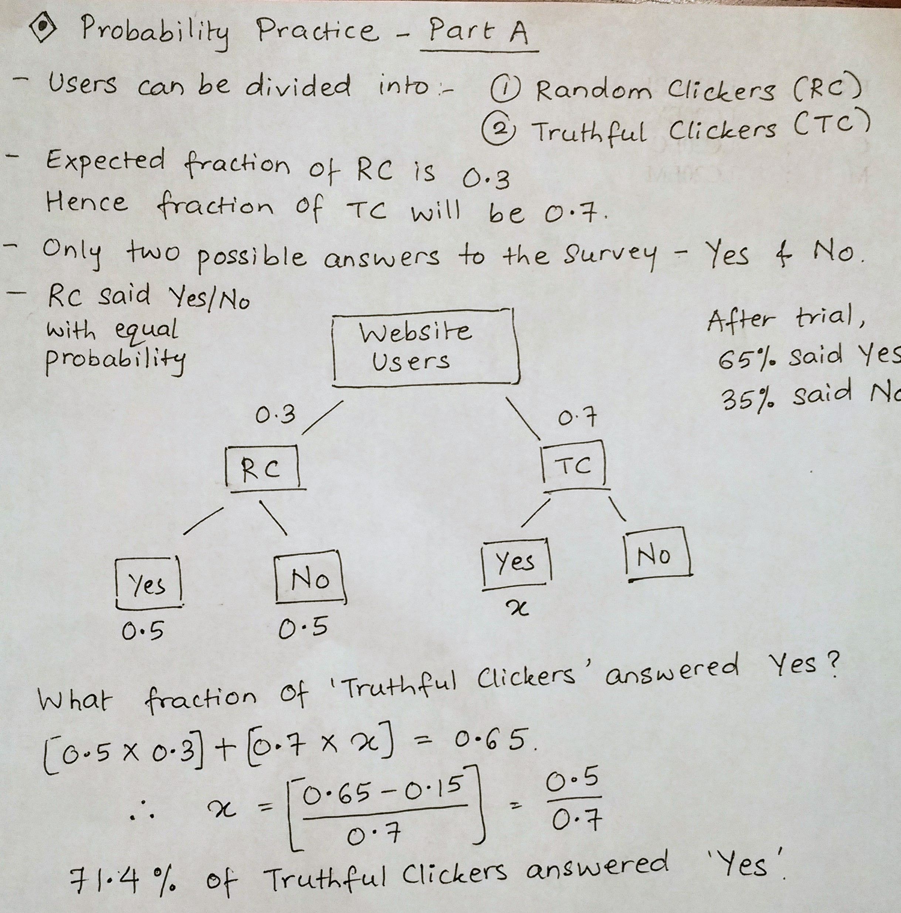
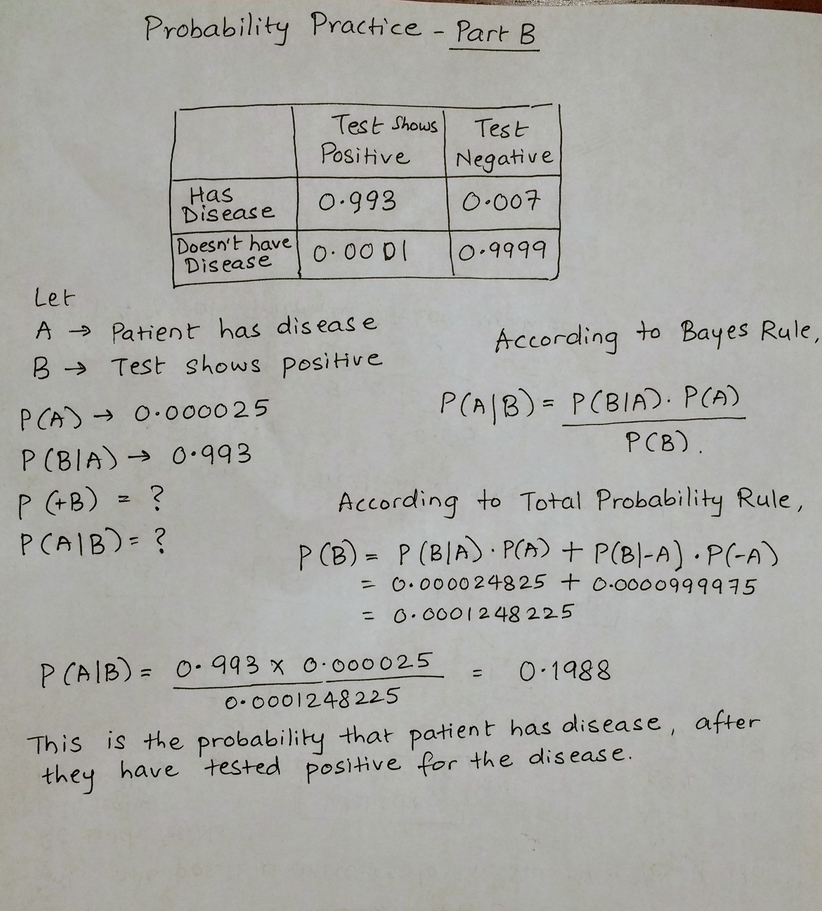

```{r setup, include=FALSE}
knitr::opts_chunk$set(
	echo = TRUE,
	message = FALSE,
	warning = FALSE
)
```
Detailed Assignment questions at: https://github.com/abhinaya08/STA380_Exercise1/blob/master/exercises01_questions.md


## Question 1

### Answer to Part A


### Answer to Part B



The big problem would be for those who test positive of the disease. Approximately 80% of them will not have the disease. Therefore, there may have to be some retest in addition to this current test. If we were to stop at this first test calculation, this would mean many people may go under unnecessary treatment, potentially taking up resources for  others who really have the disease and need treatment.

## Question 2


```{r, message = FALSE}
library(mosaic)
library(ggplot2)
library(dplyr)

green = read.csv("greenbuildings.csv")

# Subset to remove leasing outliers
wp_outliers = green %>% 
  filter(leasing_rate<10)

par(mfrow=c(1, 2))

#box plot for rent vs green_rating
boxplot(Rent ~ green_rating, data = green, xlab = "green_rating",
        ylab = "Rent", main = "Green Data")

boxplot(Rent ~ green_rating, data = wo_outliers, xlab = "green_rating",
        ylab = "Rent", main = "Green Data")

#show class_a vs. rent and green_rating vs. rent
par(mfrow=c(1, 2))
  
boxplot(Rent ~ green_rating, data = green, xlab = "green_rating",
        ylab = "Rent", main = "Green Data")

#box plot for rent vs green_rating
boxplot(Rent ~ class_a, data = green, xlab = "class_a",
        ylab = "Rent", main = "Green Data")
```

## Question 3

### Bootstrapping

To allow the reader to make an intelligent decision to distribute his/her wealth, we will simulate the data.

First, we select the stocks that are of interest to us from the quantmod package

```{r Boots_initialization, message=FALSE}
library(mosaic)
library(quantmod)
library(foreach)

mystocks = c("SPY", "TLT", "LQD", "EEM", "VNQ")
myprices = getSymbols(mystocks)

for(ticker in mystocks) {
  expr = paste0(ticker, "a = adjustOHLC(", ticker, ")")
  eval(parse(text=expr))
  }


# Combine all the returns in a matrix
all_returns = cbind(ClCl(SPYa),
                    ClCl(TLTa),
                    ClCl(LQDa),
                    ClCl(EEMa),
                    ClCl(VNQa))
#head(all_returns)
```

As we can see above, all_returns has the closing returns for the 5 stocks we want to invest in. To determine which out of these are risky and stable, we will plot their returns and check their trend and standard deviation.

```{r Boots_plots, message=FALSE, warning=FALSE, paged.print=FALSE}
#plotting since 2007 and since 2017 to compare
#c
chartSeries(SPYa,TA='addBBands();
                    addBBands(draw="p");
                    addVo()', 
                theme="white"
                )

chartSeries(TLTa,TA='addBBands();
                    addBBands(draw="p");
                    addVo()', 
                theme="white"
                )

chartSeries(LQDa,TA='addBBands();
                    addBBands(draw="p");
                    addVo()', 
                theme="white"
                )


chartSeries(EEMa,TA='addBBands();
                    addBBands(draw="p");
                    addVo()', 
                theme="white"
                ) 

chartSeries(VNQa,TA='addBBands();
                    addBBands(draw="p");
                    addVo()', 
                theme="white"
                )

apply(all_returns,MARGIN = 2,sd,na.rm=T)
apply(all_returns,MARGIN = 2,mean,na.rm=T)
```

From the charts,SD and mean of returns over the last 10 years we can conclude that Emerging markets and Real estate exchange-traded funds have been rather unstable with higher returns.

### (a) Simulating for even split

```{r Boots_evensim,cache=TRUE}
set.seed(12345)

all_returns = as.matrix(na.omit(all_returns))
n_days = 20
initial_wealth = 100000
sim_e = foreach(i=1:50000, .combine='rbind') %do% {
  total_wealth = initial_wealth
  weights = c(0.2, 0.2, 0.2, 0.2, 0.2)
  holdings = weights * total_wealth
  wealthtracker = rep(0, n_days)
  for(today in 1:n_days) {
    return.today = resample(all_returns, 1, orig.ids=FALSE)
    holdings = holdings + holdings*return.today
    total_wealth = sum(holdings)
    wealthtracker[today] = total_wealth
    holdings = total_wealth * weights
  }
  wealthtracker
}

# Calculate 5% value at risk
initial_wealth - quantile(sim_e[,n_days], 0.05)

```

### (b) Simulating for safe split

```{r Boots_safesim, cache=TRUE}
all_returns = as.matrix(na.omit(all_returns))

n_days = 20
initial_wealth = 100000
sim_s = foreach(i=1:50000, .combine='rbind') %do% {
  total_wealth = initial_wealth
  weights = c(1/3, 1/3, 1/3, 0,0)
  holdings = weights * total_wealth
  wealthtracker = rep(0, n_days)
  for(today in 1:n_days) {
    return.today = resample(all_returns, 1, orig.ids=FALSE)
    holdings = holdings + holdings*return.today
    total_wealth = sum(holdings)
    wealthtracker[today] = total_wealth
    holdings = total_wealth * weights
  }
  wealthtracker
}

# Calculate 5% value at risk
safe_split <- initial_wealth - quantile(sim_s[,n_days], 0.05)

```

### (b) Simulating for aggressive split

```{r Boots_aggsim, cache=TRUE}
all_returns = as.matrix(na.omit(all_returns))

n_days = 20
initial_wealth = 100000
sim_a = foreach(i=1:50000, .combine='rbind') %do% {
  total_wealth = initial_wealth
  weights = c(0, 0, 0, 0.5, 0.5)
  holdings = weights * total_wealth
  wealthtracker = rep(0, n_days)
  for(today in 1:n_days) {
    return.today = resample(all_returns, 1, orig.ids=FALSE)
    holdings = holdings + holdings*return.today
    total_wealth = sum(holdings)
    wealthtracker[today] = total_wealth
    holdings = total_wealth * weights
  }
  wealthtracker
}

# Calculate 5% value at risk
agg_split <- initial_wealth - quantile(sim_a[,n_days], 0.05)
```
We looked at a decade’s worth of daily data for each one of the ETFs and observed the following:
•All the ETFs had a downturn during 2008.
•SPY shows overall steady growth. There are some small dips in performance. However, the chart shows SPY value is on an upward trend. 
•TLT shows growth over time
•LDQ shows steady growth over time, similar to the SPY.
•EEM shows growth with volatility over time. Since the downturn in 2008, EEM has more than doubled in value.  
•VNQ shows long term growth with many sizeable dips. However, since 2008 VNQ has tripled in value.

When sampling and resampling the 4-week value return, SPY, TLT, LDQ have lower variances than that of EEM and VNQ. Therefore, we chose to have an even three-way split among SPY, TLT, and LDQ for Portfolio 2, and a two-way split between EEM and VNQ for the aggressive Portfolio 3.

From the simulations, we can observe that the loss for even split is $6,218, for the safe investor is $2,997 and for the aggresive investor is $12,495.

We find that the opportunity for higher returns also comes with a more risk of loss. The first portfolio balances the aggressive and stable ETFs. Whereas, the second portfolio minimizes the loss by investing in stable ETFs. Lastly, the third portfolio has a chance at higher returns and risk of loss. 

## Question 4

Identify the market segment that tweets about NutrientH2O?

First we are analyzing the dataset and looking at the various distributions and correlations
```{r, message = FALSE}

df <- read.csv("social_marketing.csv")
summary(df)

```
We can see from the data that most of the festures have outliers. But there are no NA's.

### Which is the most talked about category?

```{r}
#Distribution of tweets into categories
x = sort((colSums(df[-1])/sum(colSums(df[,-1])))*100,decreasing = TRUE)
barplot(x, las=2, ylab = "% of total tweets", main = "Distribution of tweets into categories", col = "skyblue",cex.names = 0.75)
#text(x=midpts, y=-2, names(x), cex=0.8, srt=45, xpd=TRUE)
```
As expected, most of the tweets are chatter, followed by photo_sharing and health_nutrition. Maybe by cleaning the dataset and excluding the chatter, photo_sharing, spam and adult taggings, the popular categories would change

Now we are excluding the noisy columns and trying to build clusters to segment the audience.

```{r}
#excluding chatter,photo_sharing, spam, adult and turks for segmentation
exclude <- c("X","chatter","uncategorized","spam","adult","photo_sharing")
clean_df <- df[,!names(df) %in% exclude]

#normalizing the data for creating better clusters, since there are so many outliers
normalize <- function(x){(x-min(x))/(max(x)-min(x))}

#creating fdf = final dataframe
fdf <- apply(clean_df,2,FUN=normalize) 
#fdf <-  scale(clean_df,center = TRUE, scale = TRUE)
```

### K-means clustering

Running the cluster algorithms to identify market segments

```{r Cluster algos}
library(ggplot2)
library(LICORS)  # for kmeans++
library(foreach)
library(mosaic)
set.seed(12345)
#cls_gap <- clusGap(fdf,FUN = kmeans, nstart = 20, K.max = 8, B = 10)
#plot(cls_gap)
#, main = "clusGap(<iid_rnorm_p=3>)  ==> k = 1  cluster is optimal")

# Run k-means with 6 clusters and 25 starts
clust1 = kmeans(fdf,5 , nstart=100)
```

The SSE for this cluster is: `clust1$betweenss / clust1$totss` at 22%

The distribution of the clusters is as follows:
```{r}
table(clust1$cluster)
```

Following lines of code is to assess the cluster means and derive the market segments:
```{r message=FALSE, warning=FALSE, include=FALSE, paged.print=FALSE}
res <- t(clust1$centers)
res[order(-res[,1]),1]
res[order(-res[,2]),2]
res[order(-res[,3]),3]
res[order(-res[,4]),4]
res[order(-res[,5]),5]
```


### Segmentation results from k-means
Following are the segments we observe in the data:
*1. cluster 1: Potential opportunity - They care about shopping but need to educated on health, nutrition and our product. Probably have the lowest engagement. Suggestion: Post more educational material? 
*2. cluster 2: Outdoorsy people who care about their health, older demographic, not parents (cash cows)
*3. Cluster 3: Retired, baby boomers, empty nesters (retweet a lot?) 
*4. Cluster 4: Suburban parents 
*5. Cluster 5: Collge students. Suggestion: Target school events and hackathons to distribute product samples. Hire a sports personality to be your brand ambassaddor.


The followers rarely tweet about dating. NutrientH2O should refrain from posting about that.

### PCA exploration
Following lines of code is to try PCA to compare to k-means
```{r}
#PCA

txpca = prcomp(fdf, scale=FALSE, rank=14)
summary(txpca)
tx_scores = predict(txpca)  # same as fxpca$x
barplot(txpca$rotation[,1], las=2,cex.names = 0.75)

```

PCA reinforces our segments from clustering. The barplot above shows that current events, sports, food and shopping are popular while dating is unpopular among the followers of NutrientH2O on Twitter.


