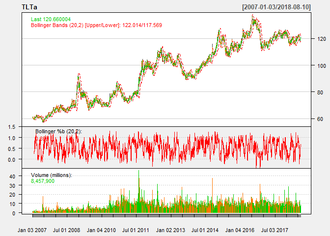
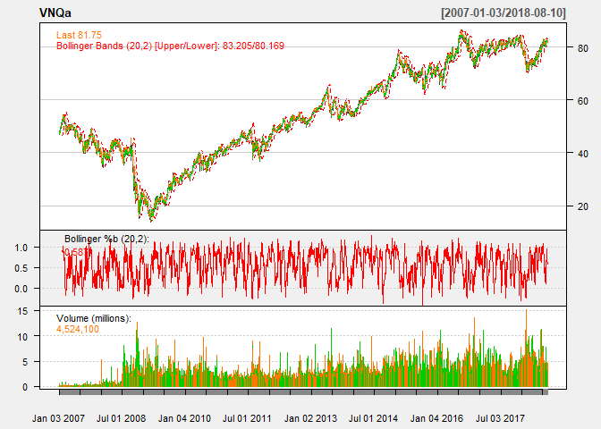

STA380\_Exercise1
================
JAST & Associates
August 4, 2018

Detailed Assignment questions at: <https://github.com/abhinaya08/STA380_Exercise1/blob/master/exercises01_questions.md>

Question 1
----------

### Answer to Part A


### Answer to Part B


The big problem would be for those who test positive of the disease. Approximately 80% of them will not have the disease. Therefore, there may have to be some retest in addition to this current test. If we were to stop at this first test calculation, this would mean many people may go under unnecessary treatment, potentially taking up resources for others who really have the disease and need treatment.

Question 2
----------

#### Evaluating the stat guru's analysis

``` r
green = read.csv("greenbuildings.csv")

# Subset to remove leasing outliers
wo_outliers = green %>% 
  filter(leasing_rate<10)

par(mfrow=c(1, 2))

#box plot for rent vs green_rating with and without outliers
boxplot(Rent ~ green_rating, data = green, xlab = "green_rating",
        ylab = "Rent", main = "Green Data")

boxplot(Rent ~ green_rating, data = wo_outliers, xlab = "green_rating",
        ylab = "Rent", main = "Green Data")
```


``` r
#show class_a vs. rent and green_rating vs. rent
par(mfrow=c(1, 2))
  
boxplot(Rent ~ green_rating, data = green, xlab = "green_rating",
        ylab = "Rent", main = "Green Data")

#box plot for rent vs green_rating
boxplot(Rent ~ class_a, data = green, xlab = "class_a",
        ylab = "Rent", main = "Green Data")
```

 Although we agree that green buildings are a worthwhile investment, we do not entirely agree with the stats guru’s analysis. First, we decided to leave outliers with the data to observe to what extent do these outliers affect the rest of our analysis. We looked at a number of variables and decided to focus on class\_a, age, leasing\_rate. From our exploratory analysis, all green buildings but one had an occupancy rate above 50%, and many buildings were less than 20 years old. And since the building will be in a great part of Austin, in a location of prime real estate, we expect the building to be of a similar standard. In addition, based on the charts above, we observe there is a difference between class\_a and non-class\_a buildings median cost of rent, which includes outliers. Combined with this and the Rent vs. green\_rating boxplot, our plots suggest that there are other significant variables that contribute to the expected rent of a building.

#### Our Analysis: Go green or not?

The following plots are to better understand the dataset and test few of our initial hypothesis to make assumptions and then carry out our analysis.

``` r
green_new = green %>%
  mutate(leasing_bucket = ifelse(leasing_rate < 30, "0-30",ifelse((leasing_rate >= 30 & leasing_rate <60),"30-60",ifelse(leasing_rate >= 90,"90-100","60-90")))) %>%
  mutate(age_bucket = ifelse(age<10,"0-9",ifelse(age>10,"10-20","20-190")) ) %>%
  mutate(green_rating = as.factor(green_rating)) %>%
  mutate(class_1 = ifelse(class_a == 1,"a", ifelse(class_b == 1,"b","c"))) %>%
  mutate(rent_bucket = cut2(green$Rent, g=4))
```

The following graph shows that Green buildings have a higher occupancy rate.

``` r
par(mfrow = c(1,3))
ggplot(green_new, aes(x=leasing_bucket, fill = green_rating)) + geom_bar(position = "fill") + labs(x= "% Occupancy rate",y="Relative frequency", title = "Number of green buildings across occupancy rates", fill = "Green building") + scale_fill_discrete(name = "Green Building", breaks = c(0,1), labels =c("No","Yes"))
```

 The following graph shows that the proportion of green buildings is highest when the building ages are between 20 to 190 years.

``` r
ggplot(green_new, aes(x=age_bucket, fill = green_rating)) + geom_bar(position = "fill") + labs(x= "Age of building in years",y="Relative frequency", title = "Number of green buildings in age buckets ", fill = "Green building") + scale_fill_discrete(name = "Green Building", breaks = c(0,1), labels =c("No","Yes"))
```

 In the following plot we observe that the rent tends to be higher in the green buildings which are older.

``` r
ggplot(green_new, aes(x = leasing_bucket, y=Rent,fill = green_rating))+geom_col(position = "dodge")+ labs(x= "% Occupancy rate of buildings",y="Rent", title = "Rent of green buildings accross occupany rates", fill = "Green building") + scale_fill_discrete(name = "Green Building", breaks = c(0,1), labels =c("No","Yes"))
```

 We observe from the plot below that most of the green buildings are of class a.

``` r
ggplot(green_new, aes(x= green_rating,fill = class_1)) + geom_bar(position = "fill") + labs(x= "Green rating of building",y="Relative frequency", title = "Frequency of classes across green buildings ", fill = "Building class") + scale_x_discrete(labels = c("0" ="No","1" = "Yes"))
```


**Based on the plots, we make the following assumptions:** The building we are planning to invest is in a good neighborhood where most of the buildings will be class\_a (Note: we assume that class\_A buildings are more likely to be in a good neighbourhood). Additionally, since our building is new, we would like to compare rents across newer buildings.

#### Best and worst case scenario

We observe that the rent varies across levels of occupancy and the occupany rates for green buildings tend to higher. For this analysis we propose analyzing a best case and worst case scenario to estimate the ROI. **Best case scenario: &gt;90% occupancy rate** We consider &gt;90% occupancy rate as the best case scenario and &lt;30% occupancy rate as the worst. **Worst case scenario: 30%-60% occupancy rate** The number of green buildings below 30% occupancy rate are very old, so we consider 30%-60% occupancy rate as our worst case scenario.

#### Test environment setup

To compare the variation of rent across types of buildings, we will consider the buildings that are: 1. Classified as class a 2. Not older than 20 years 3. Occupied more than 90% or between 30%-60% This ensures we are looking at similar buildings for comparison.

``` r
green_final = green_new %>%
  filter(leasing_bucket == "90-100"|leasing_bucket == "30-60") %>%
  filter(class_a ==1) %>%
  filter(age_bucket == "0-9"|age_bucket == "10-20")

ggplot(green_final,aes(green_rating, fill = rent_bucket)) +  geom_bar(position = "stack") + facet_grid(age_bucket ~ leasing_bucket, scales = "free") + scale_x_discrete("Rating of green building", labels = c("0" ="No","1" = "Yes")) +  labs(title = "Variation in green buildings across rent and occupancy rate", y ="Count", fill = "Rent buckets") 
```

 This plot shows the variation of rent across occupancy rate (on the secondary x axis) and age of building (on the secondary y axis). We can observe that the rent for green buildings is not higher and other factors than just the building been 'green' should be considered to decide if we should invest in the building.

#### Conclusion

Insert conclusion here

Question 3
----------

### Bootstrapping

To allow the reader to make an intelligent decision to distribute his/her wealth, we will simulate their investments.

First, we select the stocks that are of interest to us from the quantmod package

``` r
mystocks = c("SPY", "TLT", "LQD", "EEM", "VNQ")
myprices = getSymbols(mystocks)

for(ticker in mystocks) {
  expr = paste0(ticker, "a = adjustOHLC(", ticker, ")")
  eval(parse(text=expr))
  }


# Combine all the returns in a matrix
all_returns = cbind(ClCl(SPYa),
                    ClCl(TLTa),
                    ClCl(LQDa),
                    ClCl(EEMa),
                    ClCl(VNQa))
#head(all_returns)
```

As we can see above, all\_returns has the closing returns for the 5 stocks we want to invest in. To determine which out of these are risky and stable, we will plot their returns and check their trend and standard deviation.

``` r
#plotting since 2007 and since 2017 to compare
#c
chartSeries(SPYa,TA='addBBands();
                    addBBands(draw="p");
                    addVo()', 
                theme="white"
                )
```


``` r
chartSeries(TLTa,TA='addBBands();
                    addBBands(draw="p");
                    addVo()', 
                theme="white"
                )
```



``` r
chartSeries(LQDa,TA='addBBands();
                    addBBands(draw="p");
                    addVo()', 
                theme="white"
                )
```


``` r
chartSeries(EEMa,TA='addBBands();
                    addBBands(draw="p");
                    addVo()', 
                theme="white"
                ) 
```


``` r
chartSeries(VNQa,TA='addBBands();
                    addBBands(draw="p");
                    addVo()', 
                theme="white"
                )
```



``` r
apply(all_returns,MARGIN = 2,sd,na.rm=T)
```

    ##   ClCl.SPYa   ClCl.TLTa   ClCl.LQDa   ClCl.EEMa   ClCl.VNQa 
    ## 0.012448436 0.009156927 0.005219542 0.040240709 0.021159767

``` r
apply(all_returns,MARGIN = 2,mean,na.rm=T)
```

    ##    ClCl.SPYa    ClCl.TLTa    ClCl.LQDa    ClCl.EEMa    ClCl.VNQa 
    ## 0.0003983176 0.0002737537 0.0002067942 0.0009971055 0.0004095163

From the charts,SD and mean of returns over the last 10 years we can conclude that Emerging markets and Real estate exchange-traded funds have been rather unstable with higher returns (risky) while the others are stable.

### (a) Simulating for even split

``` r
set.seed(12345)

all_returns = as.matrix(na.omit(all_returns))
n_days = 20
initial_wealth = 100000
sim_e = foreach(i=1:50000, .combine='rbind') %do% {
  total_wealth = initial_wealth
  weights = c(0.2, 0.2, 0.2, 0.2, 0.2)
  holdings = weights * total_wealth
  wealthtracker = rep(0, n_days)
  for(today in 1:n_days) {
    return.today = resample(all_returns, 1, orig.ids=FALSE)
    holdings = holdings + holdings*return.today
    total_wealth = sum(holdings)
    wealthtracker[today] = total_wealth
    holdings = total_wealth * weights
  }
  wealthtracker
}
```

#### Value at risk for a balanced portfolio at 5% level

``` r
# Calculate 5% value at risk
initial_wealth - quantile(sim_e[,n_days], 0.05)
```

    ##       5% 
    ## 6135.512

### (b) Simulating for safe split

``` r
all_returns = as.matrix(na.omit(all_returns))

n_days = 20
initial_wealth = 100000
sim_s = foreach(i=1:50000, .combine='rbind') %do% {
  total_wealth = initial_wealth
  weights = c(1/3, 1/3, 1/3, 0,0)
  holdings = weights * total_wealth
  wealthtracker = rep(0, n_days)
  for(today in 1:n_days) {
    return.today = resample(all_returns, 1, orig.ids=FALSE)
    holdings = holdings + holdings*return.today
    total_wealth = sum(holdings)
    wealthtracker[today] = total_wealth
    holdings = total_wealth * weights
  }
  wealthtracker
}
```

#### Value at risk for a risk-averse portfolio at 5% level

``` r
# Calculate 5% value at risk
initial_wealth - quantile(sim_s[,n_days], 0.05)
```

    ##       5% 
    ## 3008.595

### (c) Simulating for aggressive split

``` r
all_returns = as.matrix(na.omit(all_returns))

n_days = 20
initial_wealth = 100000
sim_a = foreach(i=1:50000, .combine='rbind') %do% {
  total_wealth = initial_wealth
  weights = c(0, 0, 0, 0.5, 0.5)
  holdings = weights * total_wealth
  wealthtracker = rep(0, n_days)
  for(today in 1:n_days) {
    return.today = resample(all_returns, 1, orig.ids=FALSE)
    holdings = holdings + holdings*return.today
    total_wealth = sum(holdings)
    wealthtracker[today] = total_wealth
    holdings = total_wealth * weights
  }
  wealthtracker
}
```

#### Value at risk for an aggressive portfolio at 5% level

``` r
# Calculate 5% value at risk
initial_wealth - quantile(sim_a[,n_days], 0.05)
```

    ##       5% 
    ## 12523.32

We looked at a decade’s worth of daily data for each one of the ETFs and observed the following: - All the ETFs had a downturn during 2008. - SPY shows overall steady growth. There are some small dips in performance. However, the chart shows SPY value is on an upward trend. - TLT shows growth over time - LDQ shows steady growth over time, similar to the SPY. - EEM shows growth with volatility over time. Since the downturn in 2008, EEM has more than doubled in value.
- VNQ shows long term growth with many sizeable dips. However, since 2008 VNQ has tripled in value.

When sampling and resampling the 4-week value return, SPY, TLT, LDQ have lower variances than that of EEM and VNQ. Therefore, we chose to have an even three-way split among SPY, TLT, and LDQ for Portfolio 2, and a two-way split between EEM and VNQ for the aggressive Portfolio 3.

From the simulations, we can observe that the loss for even split is $6,218, for the safe investor is $2,997 and for the aggresive investor is $12,495.

We find that the opportunity for higher returns also comes with a more risk of loss. The first portfolio balances the aggressive and stable ETFs. Whereas, the second portfolio minimizes the loss by investing in stable ETFs. Lastly, the third portfolio has a chance at higher returns and risk of loss.

Question 4
----------

Identify the market segment that tweets about NutrientH2O?

First we are analyzing the dataset and looking at the various distributions and correlations

``` r
df <- read.csv("social_marketing.csv")
#summary(df)
```

We can observe from the `summary(df)` output that most of the features have outliers. But there are no NA's. Hence it is important to normalize the data.

### Which is the most talked about category?

``` r
#Distribution of tweets into categories
x = sort((colSums(df[-1])/sum(colSums(df[,-1])))*100,decreasing = TRUE)
barplot(x, las=2, ylab = "% of total tweets", main = "Distribution of tweets into categories", col = "skyblue",cex.names = 0.75)
```


``` r
#text(x=midpts, y=-2, names(x), cex=0.8, srt=45, xpd=TRUE)
```

As expected, most of the tweets are chatter, followed by photo\_sharing and health\_nutrition. Maybe if we clean up the dataset by excluding the chatter, photo\_sharing, spam and adult taggings, the popular categories would change.

Now we are excluding the noisy columns and trying to build clusters to segment the audience.

``` r
#excluding chatter,photo_sharing, spam, adult and turks for segmentation
exclude <- c("X","chatter","uncategorized","spam","adult","photo_sharing")
clean_df <- df[,!names(df) %in% exclude]

#normalizing the data for creating better clusters, since there are so many outliers
normalize <- function(x){(x-min(x))/(max(x)-min(x))}

#creating fdf = final dataframe
fdf <- apply(clean_df,2,FUN=normalize) 
#fdf <-  scale(clean_df,center = TRUE, scale = TRUE)
```

### K-means clustering

Running the cluster algorithms to identify market segments

``` r
set.seed(12345)
#cls_gap <- clusGap(fdf,FUN = kmeans, nstart = 20, K.max = 8, B = 10)
#plot(cls_gap)
#, main = "clusGap(<iid_rnorm_p=3>)  ==> k = 1  cluster is optimal")

# Run k-means with 6 clusters and 25 starts
clust1 = kmeans(fdf,5 , nstart=100)
```

The SSE for this cluster is: `clust1$betweenss / clust1$totss` at 22%

Note: After exploring k from 1 through 8 and trying kmeans++, k=5 was chosen. It was a trade-off between the lowest SSE and interpretation of the custers.

The distribution of the clusters is as follows:

``` r
table(clust1$cluster)
```

    ## 
    ##    1    2    3    4    5 
    ## 3918  913 1876  777  398

Following lines of code is to assess the cluster means and derive the market segments:

### Segmentation results from k-means

Following are the segments we observe in the data: 1. Cluster 1: **Potential opportunity** These followers tweet about shopping but need to educated on health, nutrition and our products. They probably have the lowest engagement among the other clusters. Our suggestion to get them more involved is to post educational and factual material about our products on social media. 2. Cluster 2: **Fitness enthusiasts** The followers' high affinity towards personal\_fitness, health\_nutrition and outdoors interest in sports is a clear indicator that this segment is the target audience for Nutrient H2O. They are primarily middle-aged, but not necessarily parents. 3. Cluster 3: **Baby Boomers** This older demographic is characterized by a preference towards current events and shopping for home and garden supplies. They probably retweet a lot and follow our page to share the information with their kids and friends. 4. Cluster 4: **Suburban parents** Sports fandom, Parenting, Food, Religion, Family and School are the hallmark personality of soccer moms or suburban dads. Given the rising level of fitness among parents and their stable income, they are a good segment to market our premium products. 5. Cluster 5: **Collge students** This segment is indifferent to health and nutrition, but if we invest and get them onboard early, they may become one of our highest LTV customers. To market to this segment we recommend targeting school events and hackathons to distribute product samples. Additionally, hiring a popular sports personality as NutrientH2O's brand ambassaddor will drive higher engagement from this group.

*We can also observe that across the board, the followers rarely tweet about dating. NutrientH2O should refrain from posting about that.*

### PCA exploration

Following lines of code is to try PCA to compare to k-means

``` r
#PCA

txpca = prcomp(fdf, scale=FALSE, rank=14)
summary(txpca)
```

    ## Importance of first k=14 (out of 31) components:
    ##                           PC1     PC2     PC3     PC4     PC5     PC6
    ## Standard deviation     0.2259 0.17943 0.16969 0.15825 0.14888 0.14582
    ## Proportion of Variance 0.1391 0.08776 0.07849 0.06827 0.06042 0.05796
    ## Cumulative Proportion  0.1391 0.22688 0.30537 0.37364 0.43407 0.49203
    ##                            PC7    PC8     PC9    PC10    PC11    PC12
    ## Standard deviation     0.14261 0.1397 0.12723 0.11788 0.11387 0.10495
    ## Proportion of Variance 0.05544 0.0532 0.04412 0.03788 0.03534 0.03003
    ## Cumulative Proportion  0.54747 0.6007 0.64479 0.68267 0.71802 0.74805
    ##                           PC13    PC14
    ## Standard deviation     0.10178 0.09400
    ## Proportion of Variance 0.02824 0.02409
    ## Cumulative Proportion  0.77628 0.80037

``` r
tx_scores = predict(txpca)  # same as fxpca$x
barplot(txpca$rotation[,1], las=2,cex.names = 0.75)
```


PCA reinforces our segments from clustering. The barplot above shows that current events, sports, food and shopping are popular while dating is unpopular among the followers of NutrientH2O on Twitter. Although PCA identifies 15 different segments (or directions), there is an overlap between the directions. K-means does a better job at summarizing the segments without penalizing the accuracy abundantly.
