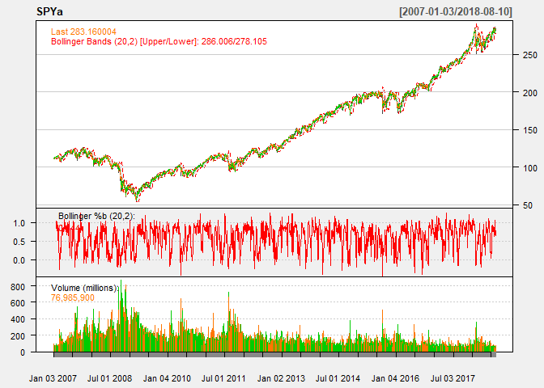

STA380\_Exercise1
================
Abhinaya, Jui, Sherlley, Teeru
August 7, 2018

Question 1
==========


Question 2
==========

Question 3
==========

Bootstrapping
-------------

To allow the reader to make an intelligent decision to distribute his/her wealth, we will simulate the data.

First, we select the stocks that are of interest to us from the quantmod package

``` r
library(mosaic)
library(quantmod)
library(foreach)

mystocks = c("SPY", "TLT", "LQD", "EEM", "VNQ")
myprices = getSymbols(mystocks)

for(ticker in mystocks) {
  expr = paste0(ticker, "a = adjustOHLC(", ticker, ")")
  eval(parse(text=expr))
  }


# Combine all the returns in a matrix
all_returns = cbind(ClCl(SPYa),
                    ClCl(TLTa),
                    ClCl(LQDa),
                    ClCl(EEMa),
                    ClCl(VNQa))
#head(all_returns)
```

As we can see above, all\_returns has the closing returns for the 5 stocks we want to invest in. To determine which out of these are risky and stable, we will plot their returns and check their trend and standard deviation.

``` r
#plotting since 2007 and since 2017 to compare
#c
chartSeries(SPYa,TA='addBBands();
                    addBBands(draw="p");
                    addVo()', 
                theme="white"
                )
```



``` r
chartSeries(TLTa,TA='addBBands();
                    addBBands(draw="p");
                    addVo()', 
                theme="white"
                )
```


``` r
chartSeries(LQDa,TA='addBBands();
                    addBBands(draw="p");
                    addVo()', 
                theme="white"
                )
```


``` r
chartSeries(EEMa,TA='addBBands();
                    addBBands(draw="p");
                    addVo()', 
                theme="white"
                ) 
```


``` r
chartSeries(VNQa,TA='addBBands();
                    addBBands(draw="p");
                    addVo()', 
                theme="white"
                )
```


``` r
apply(all_returns,MARGIN = 2,sd,na.rm=T)
```

    ##   ClCl.SPYa   ClCl.TLTa   ClCl.LQDa   ClCl.EEMa   ClCl.VNQa 
    ## 0.012450525 0.009157254 0.005220425 0.040247536 0.021163391

``` r
apply(all_returns,MARGIN = 2,mean,na.rm=T)
```

    ##    ClCl.SPYa    ClCl.TLTa    ClCl.LQDa    ClCl.EEMa    ClCl.VNQa 
    ## 0.0003989219 0.0002709645 0.0002065972 0.0009984528 0.0004094902

From the charts,SD and mean of returns over the last 10 years we can conclude that Emerging markets and Real estate exchange-traded funds have been rather unstable with higher returns.

### (a) Simulating for even split

``` r
set.seed(12345)

all_returns = as.matrix(na.omit(all_returns))
n_days = 20
initial_wealth = 100000
sim1 = foreach(i=1:50000, .combine='rbind') %do% {
  total_wealth = initial_wealth
  weights = c(0.2, 0.2, 0.2, 0.2, 0.2)
  holdings = weights * total_wealth
  wealthtracker = rep(0, n_days)
  for(today in 1:n_days) {
    return.today = resample(all_returns, 1, orig.ids=FALSE)
    holdings = holdings + holdings*return.today
    total_wealth = sum(holdings)
    wealthtracker[today] = total_wealth
    holdings = total_wealth * weights
  }
  wealthtracker
}

# Calculate 5% value at risk
even_split <- initial_wealth - quantile(sim1[,n_days], 0.05)
```

### (b) Simulating for safe split

``` r
all_returns = as.matrix(na.omit(all_returns))

n_days = 20
initial_wealth = 100000
sim1 = foreach(i=1:50000, .combine='rbind') %do% {
  total_wealth = initial_wealth
  weights = c(1/3, 1/3, 1/3, 0,0)
  holdings = weights * total_wealth
  wealthtracker = rep(0, n_days)
  for(today in 1:n_days) {
    return.today = resample(all_returns, 1, orig.ids=FALSE)
    holdings = holdings + holdings*return.today
    total_wealth = sum(holdings)
    wealthtracker[today] = total_wealth
    holdings = total_wealth * weights
  }
  wealthtracker
}

# Calculate 5% value at risk
safe_split <- initial_wealth - quantile(sim1[,n_days], 0.05)
```

### (b) Simulating for aggressive split

``` r
all_returns = as.matrix(na.omit(all_returns))

n_days = 20
initial_wealth = 100000
sim1 = foreach(i=1:50000, .combine='rbind') %do% {
  total_wealth = initial_wealth
  weights = c(0, 0, 0, 0.5, 0.5)
  holdings = weights * total_wealth
  wealthtracker = rep(0, n_days)
  for(today in 1:n_days) {
    return.today = resample(all_returns, 1, orig.ids=FALSE)
    holdings = holdings + holdings*return.today
    total_wealth = sum(holdings)
    wealthtracker[today] = total_wealth
    holdings = total_wealth * weights
  }
  wealthtracker
}

# Calculate 5% value at risk
agg_split <- initial_wealth - quantile(sim1[,n_days], 0.05)
```

From the simulations, we can observe that the loss for even split is `even_split`, for the safe investor is `safe_split` and for the aggresive investor is `agg_split`.

Question 4
----------

Identify the market segment that tweets about NutrientH2O?

First we are analyzing the dataset and looking at the various distributions and correlations

``` r
df <- read.csv("social_marketing.csv")
summary(df)
```

    ##          X           chatter       current_events      travel      
    ##  123pxkyqj:   1   Min.   : 0.000   Min.   :0.000   Min.   : 0.000  
    ##  12grikctu:   1   1st Qu.: 2.000   1st Qu.:1.000   1st Qu.: 0.000  
    ##  12klxic7j:   1   Median : 3.000   Median :1.000   Median : 1.000  
    ##  12t4msroj:   1   Mean   : 4.399   Mean   :1.526   Mean   : 1.585  
    ##  12yam59l3:   1   3rd Qu.: 6.000   3rd Qu.:2.000   3rd Qu.: 2.000  
    ##  132y8f6aj:   1   Max.   :26.000   Max.   :8.000   Max.   :26.000  
    ##  (Other)  :7876                                                    
    ##  photo_sharing    uncategorized      tv_film      sports_fandom   
    ##  Min.   : 0.000   Min.   :0.000   Min.   : 0.00   Min.   : 0.000  
    ##  1st Qu.: 1.000   1st Qu.:0.000   1st Qu.: 0.00   1st Qu.: 0.000  
    ##  Median : 2.000   Median :1.000   Median : 1.00   Median : 1.000  
    ##  Mean   : 2.697   Mean   :0.813   Mean   : 1.07   Mean   : 1.594  
    ##  3rd Qu.: 4.000   3rd Qu.:1.000   3rd Qu.: 1.00   3rd Qu.: 2.000  
    ##  Max.   :21.000   Max.   :9.000   Max.   :17.00   Max.   :20.000  
    ##                                                                   
    ##     politics           food            family        home_and_garden 
    ##  Min.   : 0.000   Min.   : 0.000   Min.   : 0.0000   Min.   :0.0000  
    ##  1st Qu.: 0.000   1st Qu.: 0.000   1st Qu.: 0.0000   1st Qu.:0.0000  
    ##  Median : 1.000   Median : 1.000   Median : 1.0000   Median :0.0000  
    ##  Mean   : 1.789   Mean   : 1.397   Mean   : 0.8639   Mean   :0.5207  
    ##  3rd Qu.: 2.000   3rd Qu.: 2.000   3rd Qu.: 1.0000   3rd Qu.:1.0000  
    ##  Max.   :37.000   Max.   :16.000   Max.   :10.0000   Max.   :5.0000  
    ##                                                                      
    ##      music              news        online_gaming       shopping     
    ##  Min.   : 0.0000   Min.   : 0.000   Min.   : 0.000   Min.   : 0.000  
    ##  1st Qu.: 0.0000   1st Qu.: 0.000   1st Qu.: 0.000   1st Qu.: 0.000  
    ##  Median : 0.0000   Median : 0.000   Median : 0.000   Median : 1.000  
    ##  Mean   : 0.6793   Mean   : 1.206   Mean   : 1.209   Mean   : 1.389  
    ##  3rd Qu.: 1.0000   3rd Qu.: 1.000   3rd Qu.: 1.000   3rd Qu.: 2.000  
    ##  Max.   :13.0000   Max.   :20.000   Max.   :27.000   Max.   :12.000  
    ##                                                                      
    ##  health_nutrition  college_uni     sports_playing      cooking      
    ##  Min.   : 0.000   Min.   : 0.000   Min.   :0.0000   Min.   : 0.000  
    ##  1st Qu.: 0.000   1st Qu.: 0.000   1st Qu.:0.0000   1st Qu.: 0.000  
    ##  Median : 1.000   Median : 1.000   Median :0.0000   Median : 1.000  
    ##  Mean   : 2.567   Mean   : 1.549   Mean   :0.6392   Mean   : 1.998  
    ##  3rd Qu.: 3.000   3rd Qu.: 2.000   3rd Qu.:1.0000   3rd Qu.: 2.000  
    ##  Max.   :41.000   Max.   :30.000   Max.   :8.0000   Max.   :33.000  
    ##                                                                     
    ##       eco           computers          business         outdoors      
    ##  Min.   :0.0000   Min.   : 0.0000   Min.   :0.0000   Min.   : 0.0000  
    ##  1st Qu.:0.0000   1st Qu.: 0.0000   1st Qu.:0.0000   1st Qu.: 0.0000  
    ##  Median :0.0000   Median : 0.0000   Median :0.0000   Median : 0.0000  
    ##  Mean   :0.5123   Mean   : 0.6491   Mean   :0.4232   Mean   : 0.7827  
    ##  3rd Qu.:1.0000   3rd Qu.: 1.0000   3rd Qu.:1.0000   3rd Qu.: 1.0000  
    ##  Max.   :6.0000   Max.   :16.0000   Max.   :6.0000   Max.   :12.0000  
    ##                                                                       
    ##      crafts         automotive           art             religion     
    ##  Min.   :0.0000   Min.   : 0.0000   Min.   : 0.0000   Min.   : 0.000  
    ##  1st Qu.:0.0000   1st Qu.: 0.0000   1st Qu.: 0.0000   1st Qu.: 0.000  
    ##  Median :0.0000   Median : 0.0000   Median : 0.0000   Median : 0.000  
    ##  Mean   :0.5159   Mean   : 0.8299   Mean   : 0.7248   Mean   : 1.095  
    ##  3rd Qu.:1.0000   3rd Qu.: 1.0000   3rd Qu.: 1.0000   3rd Qu.: 1.000  
    ##  Max.   :7.0000   Max.   :13.0000   Max.   :18.0000   Max.   :20.000  
    ##                                                                       
    ##      beauty          parenting           dating            school       
    ##  Min.   : 0.0000   Min.   : 0.0000   Min.   : 0.0000   Min.   : 0.0000  
    ##  1st Qu.: 0.0000   1st Qu.: 0.0000   1st Qu.: 0.0000   1st Qu.: 0.0000  
    ##  Median : 0.0000   Median : 0.0000   Median : 0.0000   Median : 0.0000  
    ##  Mean   : 0.7052   Mean   : 0.9213   Mean   : 0.7109   Mean   : 0.7677  
    ##  3rd Qu.: 1.0000   3rd Qu.: 1.0000   3rd Qu.: 1.0000   3rd Qu.: 1.0000  
    ##  Max.   :14.0000   Max.   :14.0000   Max.   :24.0000   Max.   :11.0000  
    ##                                                                         
    ##  personal_fitness    fashion        small_business        spam        
    ##  Min.   : 0.000   Min.   : 0.0000   Min.   :0.0000   Min.   :0.00000  
    ##  1st Qu.: 0.000   1st Qu.: 0.0000   1st Qu.:0.0000   1st Qu.:0.00000  
    ##  Median : 0.000   Median : 0.0000   Median :0.0000   Median :0.00000  
    ##  Mean   : 1.462   Mean   : 0.9966   Mean   :0.3363   Mean   :0.00647  
    ##  3rd Qu.: 2.000   3rd Qu.: 1.0000   3rd Qu.:1.0000   3rd Qu.:0.00000  
    ##  Max.   :19.000   Max.   :18.0000   Max.   :6.0000   Max.   :2.00000  
    ##                                                                       
    ##      adult        
    ##  Min.   : 0.0000  
    ##  1st Qu.: 0.0000  
    ##  Median : 0.0000  
    ##  Mean   : 0.4033  
    ##  3rd Qu.: 0.0000  
    ##  Max.   :26.0000  
    ## 

We can see from the data that most of the festures have outliers. But there are no NA's.

### Which is the most talked about category?

``` r
#avg categorization for every category
sort(colMeans(df[-1]),decreasing = TRUE)
```

    ##          chatter    photo_sharing health_nutrition          cooking 
    ##      4.398756661      2.696777468      2.567241817      1.998223801 
    ##         politics    sports_fandom           travel      college_uni 
    ##      1.788632327      1.594011672      1.585003806      1.549479827 
    ##   current_events personal_fitness             food         shopping 
    ##      1.526262370      1.462065466      1.397487947      1.389368181 
    ##    online_gaming             news         religion          tv_film 
    ##      1.208830246      1.205531591      1.095407257      1.070286729 
    ##          fashion        parenting           family       automotive 
    ##      0.996574473      0.921339761      0.863867039      0.829865516 
    ##    uncategorized         outdoors           school              art 
    ##      0.812991626      0.782669373      0.767698554      0.724816037 
    ##           dating           beauty            music        computers 
    ##      0.710860188      0.705150977      0.679269221      0.649073839 
    ##   sports_playing  home_and_garden           crafts              eco 
    ##      0.639177874      0.520680030      0.515858919      0.512306521 
    ##         business            adult   small_business             spam 
    ##      0.423242832      0.403324029      0.336335955      0.006470439

``` r
#Distribution of tweets into categories
x = sort((colSums(df[-1])/sum(colSums(df[,-1])))*100,decreasing = TRUE)
barplot(x, las=2, ylab = "% of total tweets", main = "Distribution of tweets into categories", col = "skyblue",cex.names = 0.75)
```


``` r
#text(x=midpts, y=-2, names(x), cex=0.8, srt=45, xpd=TRUE)
```

As expected, most of the tweets are chatter, followed by photo\_sharing and health\_nutrition. Maybe by cleaning the dataset and excluding the chatter, photo\_sharing, spam and adult taggings, the popular categories would change

Now we are excluding the noisy columns and trying to build clusters to segment the audience.

``` r
#excluding chatter,photo_sharing, spam, adult and turks for segmentation
exclude <- c("X","chatter","uncategorized","spam","adult","photo_sharing")
clean_df <- df[,!names(df) %in% exclude]

#normalizing the data for creating better clusters, since there are so many outliers
normalize <- function(x){(x-min(x))/(max(x)-min(x))}

#creating fdf = final dataframe
fdf <- apply(clean_df,2,FUN=normalize) 
#fdf <-  scale(clean_df,center = TRUE, scale = TRUE)
```

Running the cluster algorithms to identify market segments

``` r
library(ggplot2)
library(LICORS)  # for kmeans++
library(foreach)
library(mosaic)
library(plyr)
set.seed(12345)
#cls_gap <- clusGap(fdf,FUN = kmeans, nstart = 20, K.max = 8, B = 10)
#plot(cls_gap)
#, main = "clusGap(<iid_rnorm_p=3>)  ==> k = 1  cluster is optimal")

# Run k-means with 6 clusters and 25 starts
clust1 = kmeans(fdf,5 , nstart=100)
```

The SSE for this cluster is: `clust1$betweenss / clust1$totss`

The distribution of the clusters is as follows:

``` r
table(clust1$cluster)
```

    ## 
    ##    1    2    3    4    5 
    ## 3918  913 1876  777  398

Following lines of code is to assess the cluster means and derive the market segments:

Following are the segments we observe in the data: 1. cluster 1: Potential opportunity - They care about shopping but need to educated on health, nutrition and our product. Probably have the lowest engagement. Suggestion: Post more educational material? 2. cluster 2: Outdoorsy people who care about their health, older demographic, not parents (cash cows) 3. Cluster 3: Retired, baby boomers, empty nesters (retweet a lot?) 4. Cluster 4: Suburban parents 5. Cluster 5: Collge students. Suggestion: Target school events and hackathons to distribute product samples. Hire a sports personality to be your brand ambassaddor.

The followers rarely tweet about dating. NutrientH2O should refrain from posting about that.

Following lines of code is to try PCA to compare to k-means

``` r
#PCA

txpca = prcomp(fdf, scale=FALSE, rank=14)
summary(txpca)
```

    ## Importance of first k=14 (out of 31) components:
    ##                           PC1     PC2     PC3     PC4     PC5     PC6
    ## Standard deviation     0.2259 0.17943 0.16969 0.15825 0.14888 0.14582
    ## Proportion of Variance 0.1391 0.08776 0.07849 0.06827 0.06042 0.05796
    ## Cumulative Proportion  0.1391 0.22688 0.30537 0.37364 0.43407 0.49203
    ##                            PC7    PC8     PC9    PC10    PC11    PC12
    ## Standard deviation     0.14261 0.1397 0.12723 0.11788 0.11387 0.10495
    ## Proportion of Variance 0.05544 0.0532 0.04412 0.03788 0.03534 0.03003
    ## Cumulative Proportion  0.54747 0.6007 0.64479 0.68267 0.71802 0.74805
    ##                           PC13    PC14
    ## Standard deviation     0.10178 0.09400
    ## Proportion of Variance 0.02824 0.02409
    ## Cumulative Proportion  0.77628 0.80037

``` r
tx_scores = predict(txpca)  # same as fxpca$x
barplot(txpca$rotation[,1], las=2,cex.names = 0.75)
```


PCA reinforces our segments from clustering. The barplot above shows that current events, sports, food and shopping are popular while dating is unpopular among the followers of NutrientH2O on Twitter.
