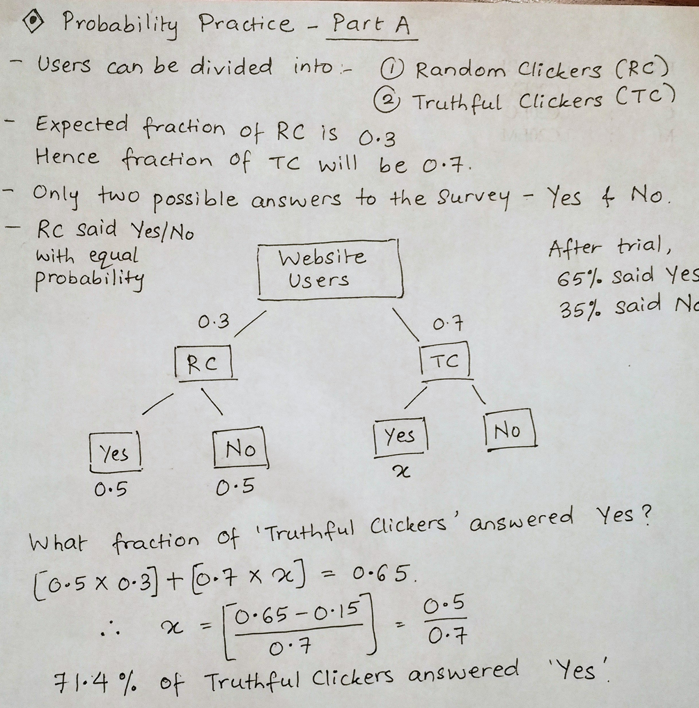
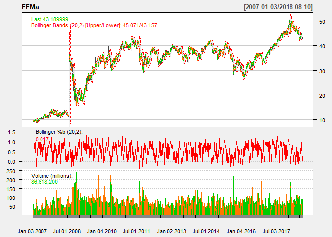

STA380\_Exercise1
================
Abhinaya, Jui, Sherlley, Teeru
August 7, 2018

Question 1
==========




Question 2
==========

You can also embed plots, for example:

Question 3
==========

Bootstrapping
-------------

First, we select the stocks that are of interest to us from the quantmod package

``` r
library(mosaic)
library(quantmod)
library(foreach)

mystocks = c("SPY", "TLT", "LQD", "EEM", "VNQ")
myprices = getSymbols(mystocks)

for(ticker in mystocks) {
  expr = paste0(ticker, "a = adjustOHLC(", ticker, ")")
  eval(parse(text=expr))
  }


# Combine all the returns in a matrix
all_returns = cbind(ClCl(SPYa),
                    ClCl(TLTa),
                    ClCl(LQDa),
                    ClCl(EEMa),
                    ClCl(VNQa))
head(all_returns)
```

    ##                ClCl.SPYa    ClCl.TLTa     ClCl.LQDa    ClCl.EEMa
    ## 2007-01-03            NA           NA            NA           NA
    ## 2007-01-04  0.0021221123  0.006063328  0.0075152938 -0.013809353
    ## 2007-01-05 -0.0079763183 -0.004352668 -0.0006526807 -0.029238205
    ## 2007-01-08  0.0046250821  0.001793566 -0.0002798843  0.007257535
    ## 2007-01-09 -0.0008498831  0.000000000  0.0001866169 -0.022336235
    ## 2007-01-10  0.0033315799 -0.004475797 -0.0013063264 -0.002303160
    ##               ClCl.VNQa
    ## 2007-01-03           NA
    ## 2007-01-04  0.001296655
    ## 2007-01-05 -0.018518518
    ## 2007-01-08  0.001451392
    ## 2007-01-09  0.012648208
    ## 2007-01-10  0.012880523

As we can see above, all\_returns has the closing returns for the 5 stocks we want to invest in. To determine which out of these are risky and stable, we will plot their returns and check their trend

``` r
#plotting since 2007 and since 2017 to compare
#c
chartSeries(SPYa,TA='addBBands();
                    addBBands(draw="p");
                    addVo()', 
                theme="white"
                )
```


``` r
chartSeries(TLTa,TA='addBBands();
                    addBBands(draw="p");
                    addVo()', 
                theme="white"
                )
```


``` r
chartSeries(LQDa,TA='addBBands();
                    addBBands(draw="p");
                    addVo()', 
                theme="white"
                )
```


``` r
chartSeries(EEMa,TA='addBBands();
                    addBBands(draw="p");
                    addVo()', 
                theme="white"
                ) 
```



``` r
chartSeries(VNQa,TA='addBBands();
                    addBBands(draw="p");
                    addVo()', 
                theme="white"
                )
```


From the charts we can conclude that Emerging markets and Real estate exchange-traded funds have been rather unstable with higher returns

### (a) Simulating for even split

``` r
set.seed(12345)

all_returns = as.matrix(na.omit(all_returns))

n_days = 20
initial_wealth = 100000
sim1 = foreach(i=1:50000, .combine='rbind') %do% {
  total_wealth = initial_wealth
  weights = c(0.2, 0.2, 0.2, 0.2, 0.2)
  holdings = weights * total_wealth
  wealthtracker = rep(0, n_days)
  for(today in 1:n_days) {
    return.today = resample(all_returns, 1, orig.ids=FALSE)
    holdings = holdings + holdings*return.today
    total_wealth = sum(holdings)
    wealthtracker[today] = total_wealth
    holdings = total_wealth * weights
  }
  wealthtracker
}

# Calculate 5% value at risk
quantile(sim1[,n_days], 0.05) - initial_wealth
```

    ##        5% 
    ## -6128.771

### (b) Simulating for safe split

``` r
all_returns = as.matrix(na.omit(all_returns))

n_days = 20
initial_wealth = 100000
sim1 = foreach(i=1:50000, .combine='rbind') %do% {
  total_wealth = initial_wealth
  weights = c(1/3, 1/3, 1/3, 0,0)
  holdings = weights * total_wealth
  wealthtracker = rep(0, n_days)
  for(today in 1:n_days) {
    return.today = resample(all_returns, 1, orig.ids=FALSE)
    holdings = holdings + holdings*return.today
    total_wealth = sum(holdings)
    wealthtracker[today] = total_wealth
    holdings = total_wealth * weights
  }
  wealthtracker
}

# Calculate 5% value at risk
quantile(sim1[,n_days], 0.05) - initial_wealth
```

    ##        5% 
    ## -2997.868

### (b) Simulating for aggressive split

``` r
all_returns = as.matrix(na.omit(all_returns))

n_days = 20
initial_wealth = 100000
sim1 = foreach(i=1:50000, .combine='rbind') %do% {
  total_wealth = initial_wealth
  weights = c(0, 0, 0, 0.5, 0.5)
  holdings = weights * total_wealth
  wealthtracker = rep(0, n_days)
  for(today in 1:n_days) {
    return.today = resample(all_returns, 1, orig.ids=FALSE)
    holdings = holdings + holdings*return.today
    total_wealth = sum(holdings)
    wealthtracker[today] = total_wealth
    holdings = total_wealth * weights
  }
  wealthtracker
}

# Calculate 5% value at risk
quantile(sim1[,n_days], 0.05) - initial_wealth
```

    ##        5% 
    ## -12495.98

Question 4
----------

Identify the market segment that tweets about NutrientH2O

First we are analyzing the dataset and looking at the various distributions and correlations

``` r
df <- read.csv("social_marketing.csv")
names(df)
```

    ##  [1] "X"                "chatter"          "current_events"  
    ##  [4] "travel"           "photo_sharing"    "uncategorized"   
    ##  [7] "tv_film"          "sports_fandom"    "politics"        
    ## [10] "food"             "family"           "home_and_garden" 
    ## [13] "music"            "news"             "online_gaming"   
    ## [16] "shopping"         "health_nutrition" "college_uni"     
    ## [19] "sports_playing"   "cooking"          "eco"             
    ## [22] "computers"        "business"         "outdoors"        
    ## [25] "crafts"           "automotive"       "art"             
    ## [28] "religion"         "beauty"           "parenting"       
    ## [31] "dating"           "school"           "personal_fitness"
    ## [34] "fashion"          "small_business"   "spam"            
    ## [37] "adult"

``` r
head(df)
```

    ##           X chatter current_events travel photo_sharing uncategorized
    ## 1 hmjoe4g3k       2              0      2             2             2
    ## 2 clk1m5w8s       3              3      2             1             1
    ## 3 jcsovtak3       6              3      4             3             1
    ## 4 3oeb4hiln       1              5      2             2             0
    ## 5 fd75x1vgk       5              2      0             6             1
    ## 6 h6nvj91yp       6              4      2             7             0
    ##   tv_film sports_fandom politics food family home_and_garden music news
    ## 1       1             1        0    4      1               2     0    0
    ## 2       1             4        1    2      2               1     0    0
    ## 3       5             0        2    1      1               1     1    1
    ## 4       1             0        1    0      1               0     0    0
    ## 5       0             0        2    0      1               0     0    0
    ## 6       1             1        0    2      1               1     1    0
    ##   online_gaming shopping health_nutrition college_uni sports_playing
    ## 1             0        1               17           0              2
    ## 2             0        0                0           0              1
    ## 3             0        2                0           0              0
    ## 4             0        0                0           1              0
    ## 5             3        2                0           4              0
    ## 6             0        5                0           0              0
    ##   cooking eco computers business outdoors crafts automotive art religion
    ## 1       5   1         1        0        2      1          0   0        1
    ## 2       0   0         0        1        0      2          0   0        0
    ## 3       2   1         0        0        0      2          0   8        0
    ## 4       0   0         0        1        0      3          0   2        0
    ## 5       1   0         1        0        1      0          0   0        0
    ## 6       0   0         1        1        0      0          1   0        0
    ##   beauty parenting dating school personal_fitness fashion small_business
    ## 1      0         1      1      0               11       0              0
    ## 2      0         0      1      4                0       0              0
    ## 3      1         0      1      0                0       1              0
    ## 4      1         0      0      0                0       0              0
    ## 5      0         0      0      0                0       0              1
    ## 6      0         0      0      0                0       0              0
    ##   spam adult
    ## 1    0     0
    ## 2    0     0
    ## 3    0     0
    ## 4    0     0
    ## 5    0     0
    ## 6    0     0

``` r
summary(df)
```

    ##          X           chatter       current_events      travel      
    ##  123pxkyqj:   1   Min.   : 0.000   Min.   :0.000   Min.   : 0.000  
    ##  12grikctu:   1   1st Qu.: 2.000   1st Qu.:1.000   1st Qu.: 0.000  
    ##  12klxic7j:   1   Median : 3.000   Median :1.000   Median : 1.000  
    ##  12t4msroj:   1   Mean   : 4.399   Mean   :1.526   Mean   : 1.585  
    ##  12yam59l3:   1   3rd Qu.: 6.000   3rd Qu.:2.000   3rd Qu.: 2.000  
    ##  132y8f6aj:   1   Max.   :26.000   Max.   :8.000   Max.   :26.000  
    ##  (Other)  :7876                                                    
    ##  photo_sharing    uncategorized      tv_film      sports_fandom   
    ##  Min.   : 0.000   Min.   :0.000   Min.   : 0.00   Min.   : 0.000  
    ##  1st Qu.: 1.000   1st Qu.:0.000   1st Qu.: 0.00   1st Qu.: 0.000  
    ##  Median : 2.000   Median :1.000   Median : 1.00   Median : 1.000  
    ##  Mean   : 2.697   Mean   :0.813   Mean   : 1.07   Mean   : 1.594  
    ##  3rd Qu.: 4.000   3rd Qu.:1.000   3rd Qu.: 1.00   3rd Qu.: 2.000  
    ##  Max.   :21.000   Max.   :9.000   Max.   :17.00   Max.   :20.000  
    ##                                                                   
    ##     politics           food            family        home_and_garden 
    ##  Min.   : 0.000   Min.   : 0.000   Min.   : 0.0000   Min.   :0.0000  
    ##  1st Qu.: 0.000   1st Qu.: 0.000   1st Qu.: 0.0000   1st Qu.:0.0000  
    ##  Median : 1.000   Median : 1.000   Median : 1.0000   Median :0.0000  
    ##  Mean   : 1.789   Mean   : 1.397   Mean   : 0.8639   Mean   :0.5207  
    ##  3rd Qu.: 2.000   3rd Qu.: 2.000   3rd Qu.: 1.0000   3rd Qu.:1.0000  
    ##  Max.   :37.000   Max.   :16.000   Max.   :10.0000   Max.   :5.0000  
    ##                                                                      
    ##      music              news        online_gaming       shopping     
    ##  Min.   : 0.0000   Min.   : 0.000   Min.   : 0.000   Min.   : 0.000  
    ##  1st Qu.: 0.0000   1st Qu.: 0.000   1st Qu.: 0.000   1st Qu.: 0.000  
    ##  Median : 0.0000   Median : 0.000   Median : 0.000   Median : 1.000  
    ##  Mean   : 0.6793   Mean   : 1.206   Mean   : 1.209   Mean   : 1.389  
    ##  3rd Qu.: 1.0000   3rd Qu.: 1.000   3rd Qu.: 1.000   3rd Qu.: 2.000  
    ##  Max.   :13.0000   Max.   :20.000   Max.   :27.000   Max.   :12.000  
    ##                                                                      
    ##  health_nutrition  college_uni     sports_playing      cooking      
    ##  Min.   : 0.000   Min.   : 0.000   Min.   :0.0000   Min.   : 0.000  
    ##  1st Qu.: 0.000   1st Qu.: 0.000   1st Qu.:0.0000   1st Qu.: 0.000  
    ##  Median : 1.000   Median : 1.000   Median :0.0000   Median : 1.000  
    ##  Mean   : 2.567   Mean   : 1.549   Mean   :0.6392   Mean   : 1.998  
    ##  3rd Qu.: 3.000   3rd Qu.: 2.000   3rd Qu.:1.0000   3rd Qu.: 2.000  
    ##  Max.   :41.000   Max.   :30.000   Max.   :8.0000   Max.   :33.000  
    ##                                                                     
    ##       eco           computers          business         outdoors      
    ##  Min.   :0.0000   Min.   : 0.0000   Min.   :0.0000   Min.   : 0.0000  
    ##  1st Qu.:0.0000   1st Qu.: 0.0000   1st Qu.:0.0000   1st Qu.: 0.0000  
    ##  Median :0.0000   Median : 0.0000   Median :0.0000   Median : 0.0000  
    ##  Mean   :0.5123   Mean   : 0.6491   Mean   :0.4232   Mean   : 0.7827  
    ##  3rd Qu.:1.0000   3rd Qu.: 1.0000   3rd Qu.:1.0000   3rd Qu.: 1.0000  
    ##  Max.   :6.0000   Max.   :16.0000   Max.   :6.0000   Max.   :12.0000  
    ##                                                                       
    ##      crafts         automotive           art             religion     
    ##  Min.   :0.0000   Min.   : 0.0000   Min.   : 0.0000   Min.   : 0.000  
    ##  1st Qu.:0.0000   1st Qu.: 0.0000   1st Qu.: 0.0000   1st Qu.: 0.000  
    ##  Median :0.0000   Median : 0.0000   Median : 0.0000   Median : 0.000  
    ##  Mean   :0.5159   Mean   : 0.8299   Mean   : 0.7248   Mean   : 1.095  
    ##  3rd Qu.:1.0000   3rd Qu.: 1.0000   3rd Qu.: 1.0000   3rd Qu.: 1.000  
    ##  Max.   :7.0000   Max.   :13.0000   Max.   :18.0000   Max.   :20.000  
    ##                                                                       
    ##      beauty          parenting           dating            school       
    ##  Min.   : 0.0000   Min.   : 0.0000   Min.   : 0.0000   Min.   : 0.0000  
    ##  1st Qu.: 0.0000   1st Qu.: 0.0000   1st Qu.: 0.0000   1st Qu.: 0.0000  
    ##  Median : 0.0000   Median : 0.0000   Median : 0.0000   Median : 0.0000  
    ##  Mean   : 0.7052   Mean   : 0.9213   Mean   : 0.7109   Mean   : 0.7677  
    ##  3rd Qu.: 1.0000   3rd Qu.: 1.0000   3rd Qu.: 1.0000   3rd Qu.: 1.0000  
    ##  Max.   :14.0000   Max.   :14.0000   Max.   :24.0000   Max.   :11.0000  
    ##                                                                         
    ##  personal_fitness    fashion        small_business        spam        
    ##  Min.   : 0.000   Min.   : 0.0000   Min.   :0.0000   Min.   :0.00000  
    ##  1st Qu.: 0.000   1st Qu.: 0.0000   1st Qu.:0.0000   1st Qu.:0.00000  
    ##  Median : 0.000   Median : 0.0000   Median :0.0000   Median :0.00000  
    ##  Mean   : 1.462   Mean   : 0.9966   Mean   :0.3363   Mean   :0.00647  
    ##  3rd Qu.: 2.000   3rd Qu.: 1.0000   3rd Qu.:1.0000   3rd Qu.:0.00000  
    ##  Max.   :19.000   Max.   :18.0000   Max.   :6.0000   Max.   :2.00000  
    ##                                                                       
    ##      adult        
    ##  Min.   : 0.0000  
    ##  1st Qu.: 0.0000  
    ##  Median : 0.0000  
    ##  Mean   : 0.4033  
    ##  3rd Qu.: 0.0000  
    ##  Max.   :26.0000  
    ## 

We can see from the data that most of the festures have outliers. But there are no NA's.

### Which is the most talked about category?

``` r
#avg categorization for every category
sort(colMeans(df[-1]),decreasing = TRUE)
```

    ##          chatter    photo_sharing health_nutrition          cooking 
    ##      4.398756661      2.696777468      2.567241817      1.998223801 
    ##         politics    sports_fandom           travel      college_uni 
    ##      1.788632327      1.594011672      1.585003806      1.549479827 
    ##   current_events personal_fitness             food         shopping 
    ##      1.526262370      1.462065466      1.397487947      1.389368181 
    ##    online_gaming             news         religion          tv_film 
    ##      1.208830246      1.205531591      1.095407257      1.070286729 
    ##          fashion        parenting           family       automotive 
    ##      0.996574473      0.921339761      0.863867039      0.829865516 
    ##    uncategorized         outdoors           school              art 
    ##      0.812991626      0.782669373      0.767698554      0.724816037 
    ##           dating           beauty            music        computers 
    ##      0.710860188      0.705150977      0.679269221      0.649073839 
    ##   sports_playing  home_and_garden           crafts              eco 
    ##      0.639177874      0.520680030      0.515858919      0.512306521 
    ##         business            adult   small_business             spam 
    ##      0.423242832      0.403324029      0.336335955      0.006470439

``` r
#Distribution of tweets into categories
x = sort((colSums(df[-1])/sum(colSums(df[,-1])))*100,decreasing = TRUE)
barplot(x)
```

 As expected, most of the tweets are chatter, followed by photo\_sharing and health\_nutrition. Maybe by cleaning the dataset and excluding the chatter, photo\_sharing, spam and adult taggings, the popular categories would change

Also to note that most of the tweets are categorized into photo\_sharing (6%) and health\_nutrition (6%)

``` r
df2 <- cbind(df, total = rowSums(df[,-1]))
df2[(df2$chatter + df2$spam + df2$adult) == df2$total,]
```

    ##  [1] X                chatter          current_events   travel          
    ##  [5] photo_sharing    uncategorized    tv_film          sports_fandom   
    ##  [9] politics         food             family           home_and_garden 
    ## [13] music            news             online_gaming    shopping        
    ## [17] health_nutrition college_uni      sports_playing   cooking         
    ## [21] eco              computers        business         outdoors        
    ## [25] crafts           automotive       art              religion        
    ## [29] beauty           parenting        dating           school          
    ## [33] personal_fitness fashion          small_business   spam            
    ## [37] adult            total           
    ## <0 rows> (or 0-length row.names)

No turk has rated a tweet as only chatter, spam or adult. This means we can exclude these columns for our segmentation exercise

``` r
#excluding chatter,photo_sharing, spam, adult and turks for segmentation
exclude <- c("X","chatter","uncategorized","spam","adult","photo_sharing")
clean_df <- df[,!names(df) %in% exclude]
colMeans(clean_df)
```

    ##   current_events           travel          tv_film    sports_fandom 
    ##        1.5262624        1.5850038        1.0702867        1.5940117 
    ##         politics             food           family  home_and_garden 
    ##        1.7886323        1.3974879        0.8638670        0.5206800 
    ##            music             news    online_gaming         shopping 
    ##        0.6792692        1.2055316        1.2088302        1.3893682 
    ## health_nutrition      college_uni   sports_playing          cooking 
    ##        2.5672418        1.5494798        0.6391779        1.9982238 
    ##              eco        computers         business         outdoors 
    ##        0.5123065        0.6490738        0.4232428        0.7826694 
    ##           crafts       automotive              art         religion 
    ##        0.5158589        0.8298655        0.7248160        1.0954073 
    ##           beauty        parenting           dating           school 
    ##        0.7051510        0.9213398        0.7108602        0.7676986 
    ## personal_fitness          fashion   small_business 
    ##        1.4620655        0.9965745        0.3363360

``` r
#normalizing the data for creating better clusters, since there are so many outliers
#normalize <- function(x){(x-min(x))/(max(x)-min(x))}

#creating fdf = final dataframe
#fdf <- apply(clean_df,2,FUN=normalize) 
fdf <-  scale(clean_df,center = TRUE, scale = TRUE)
head(fdf)
```

    ##      current_events     travel     tv_film sports_fandom    politics
    ## [1,]     -1.2028323  0.1815755 -0.04237246    -0.2748886 -0.59009085
    ## [2,]      1.1614380  0.1815755 -0.04237246     1.1134105 -0.26017908
    ## [3,]      1.1614380  1.0566463  2.36903350    -0.7376550  0.06973268
    ## [4,]      2.7376183  0.1815755 -0.04237246    -0.7376550 -0.26017908
    ## [5,]      0.3733479 -0.6934952 -0.64522395    -0.7376550  0.06973268
    ## [6,]      1.9495282  0.1815755 -0.04237246    -0.2748886 -0.59009085
    ##            food    family home_and_garden      music        news
    ## [1,]  1.4657438 0.1201991       2.0080596 -0.6594752 -0.57384947
    ## [2,]  0.3393369 1.0031532       0.6506389 -0.6594752 -0.57384947
    ## [3,] -0.2238666 0.1201991       0.6506389  0.3113846 -0.09783584
    ## [4,] -0.7870700 0.1201991      -0.7067819 -0.6594752 -0.57384947
    ## [5,] -0.7870700 0.1201991      -0.7067819 -0.6594752 -0.57384947
    ## [6,]  0.3393369 0.1201991       0.6506389  0.3113846 -0.57384947
    ##      online_gaming   shopping health_nutrition college_uni sports_playing
    ## [1,]    -0.4498032 -0.2152578        3.2100303  -0.5348282      1.3949754
    ## [2,]    -0.4498032 -0.7680965       -0.5709875  -0.5348282      0.3698779
    ## [3,]    -0.4498032  0.3375809       -0.5709875  -0.5348282     -0.6552197
    ## [4,]    -0.4498032 -0.7680965       -0.5709875  -0.1896619     -0.6552197
    ## [5,]     0.6664905  0.3375809       -0.5709875   0.8458369     -0.6552197
    ## [6,]    -0.4498032  1.9960970       -0.5709875  -0.5348282     -0.6552197
    ##            cooking        eco  computers   business   outdoors     crafts
    ## [1,]  0.8751685215  0.6335945  0.2975329 -0.6112878  1.0064885  0.5926945
    ## [2,] -0.5825825957 -0.6655710 -0.5503175  0.8330079 -0.6471107  1.8169132
    ## [3,]  0.0005178512  0.6335945 -0.5503175 -0.6112878 -0.6471107  1.8169132
    ## [4,] -0.5825825957 -0.6655710 -0.5503175  0.8330079 -0.6471107  3.0411319
    ## [5,] -0.2910323722 -0.6655710  0.2975329 -0.6112878  0.1796889 -0.6315241
    ## [6,] -0.5825825957 -0.6655710  0.2975329  0.8330079 -0.6471107 -0.6315241
    ##      automotive        art    religion     beauty   parenting     dating
    ## [1,] -0.6074479 -0.4447882 -0.04982546 -0.5310261  0.05190867  0.1622242
    ## [2,] -0.6074479 -0.4447882 -0.57206517 -0.5310261 -0.60800117  0.1622242
    ## [3,] -0.6074479  4.4644655 -0.57206517  0.2220411 -0.60800117  0.1622242
    ## [4,] -0.6074479  0.7825252 -0.57206517  0.2220411 -0.60800117 -0.3988338
    ## [5,] -0.6074479 -0.4447882 -0.57206517 -0.5310261 -0.60800117 -0.3988338
    ## [6,]  0.1245356 -0.4447882 -0.57206517 -0.5310261 -0.60800117 -0.3988338
    ##          school personal_fitness      fashion small_business
    ## [1,] -0.6460699        3.9654745 -0.545049065     -0.5441037
    ## [2,]  2.7201990       -0.6078657 -0.545049065     -0.5441037
    ## [3,] -0.6460699       -0.6078657  0.001873498     -0.5441037
    ## [4,] -0.6460699       -0.6078657 -0.545049065     -0.5441037
    ## [5,] -0.6460699       -0.6078657 -0.545049065      1.0736350
    ## [6,] -0.6460699       -0.6078657 -0.545049065     -0.5441037

Running the cluster algorithms to identify market segments

``` r
library(ggplot2)
library(LICORS)  # for kmeans++
library(foreach)
library(mosaic)
library(plyr)

#cls_gap <- clusGap(fdf,FUN = kmeans, nstart = 20, K.max = 8, B = 10)
#plot(cls_gap)
#, main = "clusGap(<iid_rnorm_p=3>)  ==> k = 1  cluster is optimal")

# Run k-means with 6 clusters and 25 starts
clust1 = kmeans(fdf, 5, nstart=100)
clust1$betweenss / clust1$totss #22% error
```

    ## [1] 0.2373547

``` r
res <- t(clust1$centers)
res[order(-res[,1]),1]
```

    ##         politics             news           travel        computers 
    ##      2.319381710      1.903012543      1.740980821      1.551595833 
    ##       automotive         business   small_business           dating 
    ##      1.097115428      0.356269632      0.253500060      0.201295094 
    ##    sports_fandom           crafts  home_and_garden              eco 
    ##      0.182721583      0.164729527      0.142078730      0.126956187 
    ##         outdoors   current_events          tv_film   sports_playing 
    ##      0.112900049      0.105529017      0.086929949      0.067202834 
    ##           family      college_uni              art             food 
    ##      0.053793132      0.040609189      0.033829823      0.024005687 
    ##         shopping        parenting    online_gaming           school 
    ##      0.016503272      0.006873036     -0.010333810     -0.033062061 
    ##         religion            music          fashion           beauty 
    ##     -0.042551925     -0.042884558     -0.155804734     -0.166029707 
    ## personal_fitness          cooking health_nutrition 
    ##     -0.193844660     -0.201699435     -0.203603630

``` r
res[order(-res[,2]),2]
```

    ##      college_uni    online_gaming          tv_film              art 
    ##     -0.007225035     -0.012122463     -0.016806767     -0.045162382 
    ##         shopping   current_events   small_business   sports_playing 
    ##     -0.056977127     -0.057379008     -0.078928514     -0.082233825 
    ##           dating            music  home_and_garden         business 
    ##     -0.093931154     -0.096521108     -0.102766148     -0.118004354 
    ##              eco       automotive           crafts           travel 
    ##     -0.153591175     -0.169075462     -0.172378805     -0.206721288 
    ##           family        computers           school             news 
    ##     -0.231228973     -0.232505174     -0.249485306     -0.249975073 
    ##         politics          fashion           beauty    sports_fandom 
    ##     -0.257858644     -0.265138759     -0.279744018     -0.282451434 
    ##         religion        parenting         outdoors health_nutrition 
    ##     -0.295064214     -0.299069447     -0.315980392     -0.334449553 
    ##          cooking personal_fitness             food 
    ##     -0.338076057     -0.339609644     -0.347249382

``` r
res[order(-res[,3]),3]
```

    ##          cooking          fashion           beauty            music 
    ##      2.491203506      2.438657194      2.353246066      0.582135992 
    ##         shopping   sports_playing         business   small_business 
    ##      0.286493492      0.276840967      0.268159586      0.262096114 
    ##           dating           school   current_events              art 
    ##      0.177963454      0.163556615      0.161369907      0.146590521 
    ##  home_and_garden      college_uni           crafts    online_gaming 
    ##      0.144406051      0.141834418      0.111895798      0.098519284 
    ##          tv_film        computers         outdoors       automotive 
    ##      0.046165136      0.037301577      0.025516673      0.018241002 
    ##           family              eco           travel personal_fitness 
    ##      0.013836697      0.009737842     -0.053798300     -0.068614972 
    ##             news health_nutrition        parenting         religion 
    ##     -0.090766330     -0.093130240     -0.094011992     -0.140312537 
    ##         politics             food    sports_fandom 
    ##     -0.143131179     -0.187620816     -0.211506444

``` r
res[order(-res[,4]),4]
```

    ##         religion        parenting    sports_fandom             food 
    ##      2.179685146      2.048472614      1.986409903      1.776798728 
    ##           school           family           crafts           beauty 
    ##      1.624229410      1.435620425      0.692630765      0.300805798 
    ##              eco  home_and_garden   sports_playing       automotive 
    ##      0.191149151      0.184891191      0.171134473      0.161881738 
    ##   small_business   current_events         business              art 
    ##      0.118261257      0.117017611      0.112702265      0.107033181 
    ##            music        computers         shopping           dating 
    ##      0.090959825      0.080163082      0.049879128      0.040566220 
    ##    online_gaming          tv_film          fashion      college_uni 
    ##      0.027659159      0.026832431      0.017918420     -0.003870875 
    ##         outdoors             news           travel personal_fitness 
    ##     -0.060757947     -0.077192391     -0.100255305     -0.106728591 
    ##          cooking health_nutrition         politics 
    ##     -0.107697857     -0.153963446     -0.205474326

``` r
res[order(-res[,5]),5]
```

    ## health_nutrition personal_fitness         outdoors              eco 
    ##       2.06389448       2.02777593       1.57293415       0.52717354 
    ##             food          cooking           dating  home_and_garden 
    ##       0.40644196       0.37643154       0.18072718       0.17265348 
    ##           crafts            music         business         shopping 
    ##       0.11082124       0.07796514       0.06783848       0.05410403 
    ##   sports_playing              art   current_events    online_gaming 
    ##       0.05035279       0.02263540       0.01283864      -0.01634873 
    ##          tv_film             news   small_business           family 
    ##      -0.03211116      -0.04517050      -0.05534008      -0.05827028 
    ##        computers      college_uni          fashion        parenting 
    ##      -0.08039193      -0.08207284      -0.10460185      -0.11517489 
    ##       automotive           travel           school         religion 
    ##      -0.11530577      -0.14843787      -0.15187302      -0.17760752 
    ##         politics           beauty    sports_fandom 
    ##      -0.18191278      -0.20256058      -0.20744290

``` r
qplot(health_nutrition, personal_fitness, data=clean_df, color=factor(clust1$cluster))
```


``` r
qplot(religion, politics, data=clean_df, color=factor(clust1$cluster))
```


``` r
qplot(current_events, shopping, data=clean_df, color=factor(clust1$cluster))
```


``` r
qplot(food, parenting, data=clean_df, color=factor(clust1$cluster))
```


``` r
# Using kmeans++ initialization
#clust2 = kmeanspp(fdf, k=6, nstart=25)
#qplot(health_nutrition, photo_sharing, data=clean_df, color=factor(clust2$cluster))
#qplot(health_nutrition, cooking, data=clean_df, color=factor(clust2$cluster))
#qplot(politics, cooking, data=clean_df, color=factor(clust2$cluster))
```
